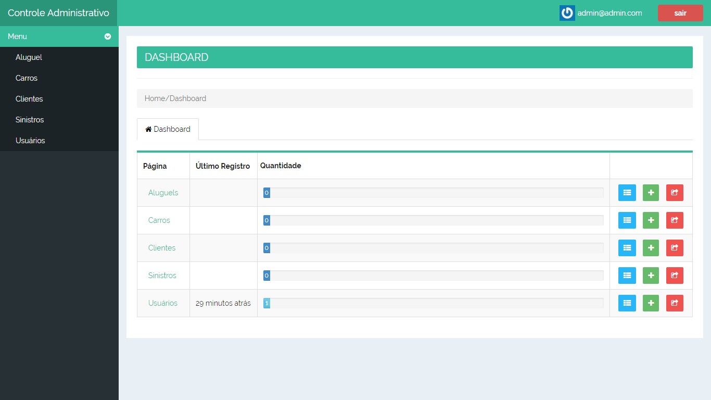

# Sistema Administrativo Locação de Veículos
=======================

O projeto administrativo para controle de locação de veículos, tem como base o estudo de caso da gem 'rails_admin' e a gem 'devise'.

-----------------------------
Recursos utilizados:
--------

- [Devise](https://github.com/plataformatec/devise) with default modules.
- [Rails Admin](https://github.com/sferik/rails_admin) (v.1.3.0) Tema utilizado 'rollincode'.
- [SendGrid](https://github.com/stephenb/sendgrid) gem for mailing.
- Continuous testing with [Guard](https://github.com/guard/guard).
- Puma server.
- PostgreSQL database.

----------------------------
Principais Funcionalidades:
-------------

- Cadastrado de Usuários
- Cadastrado de Veículos
- Cadastrado de Clientes
- Registro de Sinistros
- Controle de Alugueis

-------------
Informações Gerais
----------------------------
- Este projeto foi desenvolvido por [Douglas Lima](https://github.com/douglasproglima) seguindo o tutorial da página [Onebitcode](https://onebitcode.com/rails-admin-tutorial-1/).
- Todos os créditos deste sistema é voltado a [Leornado Scorza](https://www.facebook.com/leonardo.scorzadesouza) responsável pela página Onebitcode.
